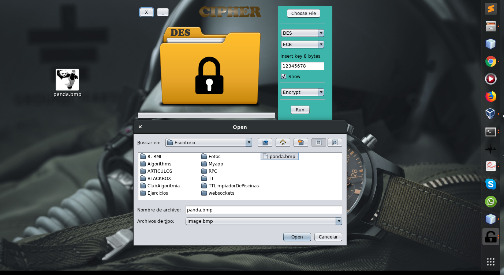

# Cifrador de imagenes bmp

Cifrador con los algoritmos DES y AES, para entender el funcionamiento de los distintos modos de operación de estos algoritmos.  

**Elaborado por:**

Amador Nava Miguel Ángel

Peralta Erick Fabián 

**Interfaz del programa**

**Modos de operación DES**

CBC

CFB

ECB

OFB

